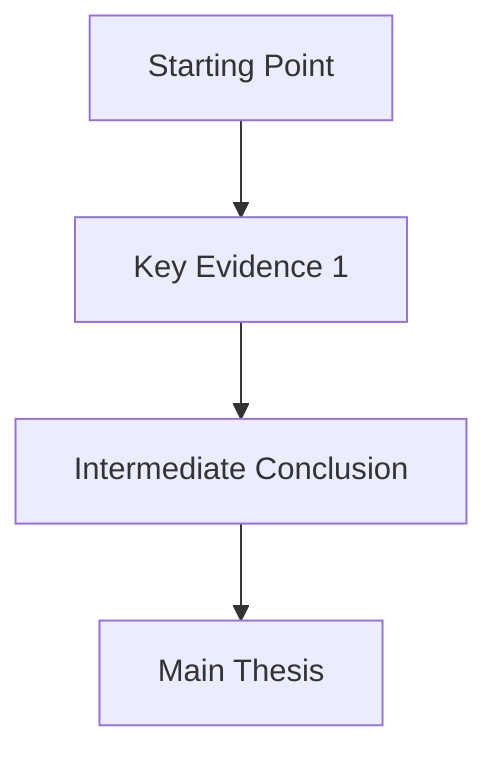

# Reading Inbox Processor

## Overview

Process saved articles (from Pocket, Instapaper, web clippings, or manual saves) into structured knowledge cards with argumentation diagrams, quotable insights, and research connections.

## When to Use

**Trigger phrases**: "process inbox", "process reading inbox", "new article to process"

## Workflow

### Step 1: Fetch Content
For web URLs:
```bash
curl -sL -H "User-Agent: Mozilla/5.0 (Macintosh; Intel Mac OS X 10_15_7)" "URL" > /tmp/article.html
```
For local files: Read directly from the inbox directory.

### Step 2: Same-Source Detection
Check if similar content already exists in the archive to avoid duplicates.

### Step 3: Generate Knowledge Card (v2 Template)

```markdown
---
title: "Article Title"
source: "Source Name"
author: "Author Name"
date: YYYY-MM-DD
url: "original URL"
tags: [tag1, tag2, tag3]
content_type: academic | industry | policy | opinion
read_date: YYYY-MM-DD
---

# Article Title

## Core Argument
One-paragraph summary of the main thesis.

## Argumentation Path


## Key Insights
1. Insight with page/section reference
2. Another insight

## Quotable Passages
> "Direct quote from the article" — Author, Source

## Research Connections
- Relates to: [existing paper/note in your collection]
- Potential citation context: "When discussing X, this supports..."

## My Reflections
[Your personal notes and reactions]
```

### Step 4: Save to Archive
Save the generated card to the reading notes archive directory.

### Step 5: Optional RAG Ingestion
```python
from rag.indexer import DocumentIndexer
indexer = DocumentIndexer()
indexer.index_document("path/to/card.md", collection="notes", doc_type="note")
```

## Configuration

Set your inbox and archive paths in the environment or config:
```
READING_INBOX_DIR=./inbox
READING_ARCHIVE_DIR=./notes/archive
```

## Integration

- Cards are auto-indexed into RAG for future retrieval
- Works with **SKILL-rag-search** for finding related existing notes
- Works with **SKILL-literature-search** for finding academic papers related to article topics
